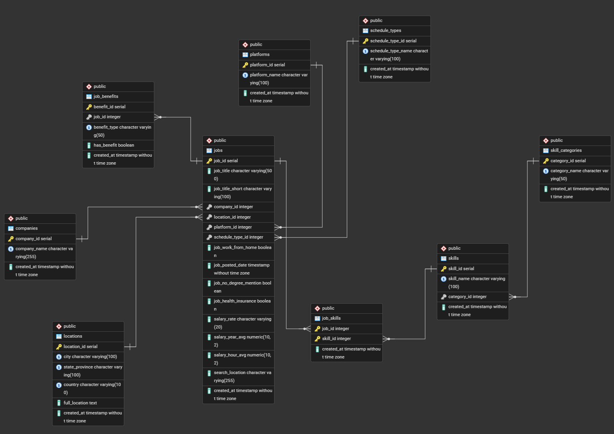
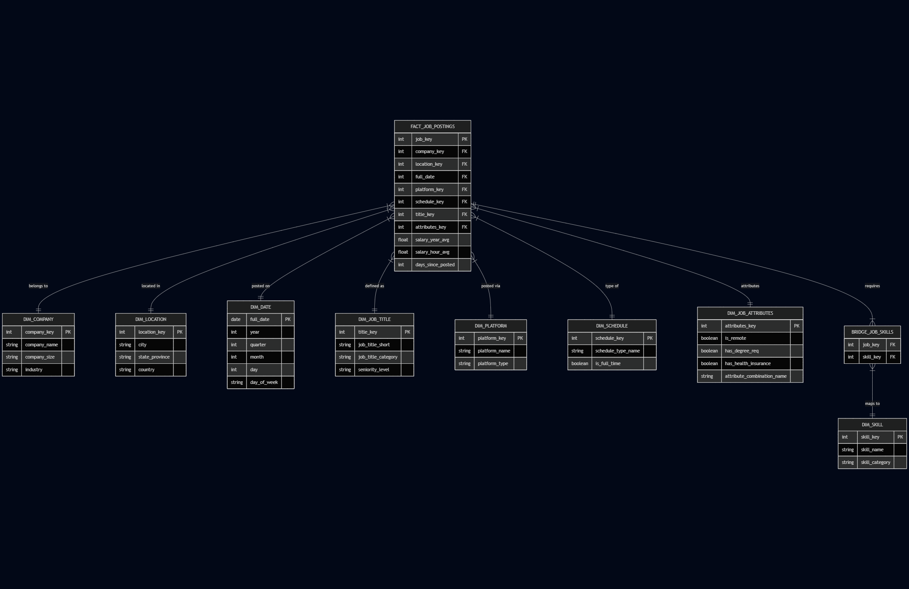

# data-engineer-assessment
The goal is to process and model job postings to create a robust database that will serve as the "single source of truth" for future analysis and applications


## Table of Contents
- [Overview](#overview)
- [Architecture](#architecture)
- [Design Decisions](#design-decisions)
- [Database Schema (3NF)](#database-schema-3nf--entity-relationship-diagram)
- [Project Structure](#project-structure)
- [Setup Instructions](#setup-instructions)
- [Running the Pipeline](#running-pipeline)
- [Testing](#testing)
- [OLAP Design (Bonus)](#olap-design-bonus) 
- [Orchestrator Integration - Airflow (Bonus)](#orchestrator-integration---airflow-bonus)


## Overview
This pipeline processes job posting data from a CSV file containing ~50,000+ job listings with semi-structured fields (*JSON*) and transforms it into a normalized PostgreSQL database suitable for analytics and business intelligence.

### Key Features
- **3NF Normalized Schema**: Eliminates data redundancy with proper dimension and fact tables
- **Docker Orchestration**: PostgreSQL database managed via Docker Compose
- **Data Validation**: Comprehensive validation using Pandera before loading
- **ETL Pipeline**: Clean separation of ingestion and transformation phases
- **Testing Suite**: Unit tests with pytest
- **Logging**: Structured logging with Loguru for pipeline observability
- **Type Safety**: Type hints throughout the codebase
- **Security**: Environment-based configuration


## Architecture
The pipeline follows a classic ETL (Extract, Transform, Load) pattern with three main phases:
```
                                       ┌──────────────────┐
                                       │    CSV Source    │
                                       │  (data_jobs.csv) │
                                       └────────┬─────────┘
                                                │
                                                ▼
                                       ┌──────────────────┐
                                       │     Phase 1:     │
                                       │  Data Ingestion  │
                                       │  - Read CSV      │
                                       │  - Validate      │
                                       │  - Load Staging  │
                                       └────────┬─────────┘
                                                │
                                                ▼
                                       ┌──────────────────┐
                                       │     Phase 2:     │
                                       │  Transformation  │
                                       │  - Normalize     │
                                       │  - Create 3NF    │
                                       │  - Load Dims     │
                                       │  - Load Facts    │
                                       └────────┬─────────┘
                                                │
                                                ▼
                                       ┌──────────────────┐
                                       │  PostgreSQL DB   │
                                       │   (3NF Schema)   │
                                       └──────────────────┘
```

### Data Flow
1. **Extraction**: CSV file is read with proper parsing of semi-structured columns (`job_skills` as lists, `job_type_skills` as dictionaries)
2. **Validation**: Data quality checks using Pandera schemas
3. **Staging**: Raw data loaded into `staging_jobs` table &rarr; *TEXT[]* for `job_skills` and *JSONB* for `job_type_skills`
4. **Transformation**: Data normalized into dimension and fact tables
5. **Loading**: Relationships established via foreign keys


## Design Decisions

### Why PostgreSQL with Docker Compose?
- **Consistency**: Docker ensures the same database environment across all machines
- **Ease of Setup**: `docker-compose up` is all that's needed
- **Production-Ready**: PostgreSQL is enterprise-grade with excellent JSON ans ARRAY support support (*JSONB* and *TEXT[]*)

### 3NF Normalization Strategy
**Key Decisions:**
1. **Dimension Tables First**: companies, locations, platforms, skills, schedule_types
   - Reduces data redundancy
   - Maintains referential integrity
   - Enables efficient lookups
2. **Jobs as Fact Table**: Contains foreign keys to all dimensions
   - Central table for analysis
   - Preserves job-specific attributes (salary, dates, boolean flags)
3. **Junction Table for Skills**: `job_skills` implements many-to-many relationship
   - One job can have multiple skills and one skill can belong to multiple jobs
   - Enables efficient skill-based queries
4. **Skill Categories**: Separate table for skill categorization
   - Supports hierarchical skill analysis
5. **Location Parsing**: Extract city, state/province, country from free-text location
   - Enables location-based analytics
   - Maintains original `full_location` for reference and uniqueness

### Why Python Over dbt (in this case)?
While dbt is excellent for SQL-based transformations, Python was chosen for:
- **Complex Parsing**: Location string parsing, JSON handling
- **Data Validation**: Pandera integration for schema validation
- **Flexibility**: Custom logic
- **Testing**: Easier unit testing with pytest
- **Orchestration**: Direct control over execution flow

### Staging Table Strategy
The `staging_jobs` table serves as an intermediary:
- **JSONB/TEXT[] Columns**: Preserves semi-structured (`job_type_skills`) and array-like (`job_skills`) data
- **Raw Data Preservation**: Keeps original data for audit trail
- **Idempotency**: Can re-run transformation without re-ingesting CSV

### Error Handling and Logging
- **Loguru**: Structured logging with automatic rotation
- **Try-Catch Blocks**: Graceful error handling at each phase
- **Transaction Management**: SQLAlchemy commits ensure data consistency
- **Validation Gates**: Pipeline stops if validation fails


## Database Schema (3NF) &rarr; Entity-Relationship Diagram



## Project Structure
```
job_pipeline/
├── config/                         # Configuration files
├── data/
│   └── data_jobs.csv               # Input CSV
├── logs/                           # Generated log files
├── sql/
│   └── schema.sql                  # Database schema (3NF)
├── src/
│   ├── __init__.py
│   ├── database.py                 # Database configuration
│   ├── ingestion.py                # Phase 1: Data ingestion
│   ├── transformation.py           # Phase 2: Data transformation
│   ├── validation.py               # Data validation with Pandera
│   └── pipeline.py                 # Main pipeline orchestrator
├── tests/
│   ├── __init__.py
│   ├── test_database.py            # Database tests
│   └── test_transformation.py      # Transformation tests
├── .coveragerc
├── .env
├── .gitignore
├── docker-compose.yaml
├── pytest.ini
├── requirements.txt
└── README.md
```


## Setup Instructions

### Step 1: Clone the Repository
```bash
git clone https://github.com/coss-fz/data-engineer-assessment.git
cd data-engineer-assessment
```

### Step 2: Create Virtual Environment
```bash
python -m venv .venv
source .venv/bin/activate  # .venv\Scripts\activate
```

### Step 3: Install Dependencies
```bash
pip install -r requirements.txt
```

### Step 4: Setup Environment Variables
```
POSTGRES_USER=<user>
POSTGRES_PASSWORD=<pwd>
POSTGRES_HOST=<host>
POSTGRES_PORT=<port_number>
POSTGRES_DB=<db>
PGADMIN_DEFAULT_EMAIL=<email@domain.com>
PGADMIN_DEFAULT_PASSWORD=<pwd>
PGADMIN_PORT=<port_number>
```

### Step 5: Place Your Data File
```bash
mkdir -p data
cp /path/to/data_jobs.csv data/
```

### Step 6: Start PostgreSQL Database
```bash
docker-compose up -d
```

### Step 7: Create Logs Directory
```bash
mkdir -p logs
```


## Running Pipeline

### Full Pipeline Execution
```bash
python src/pipeline.py --csv data/data_jobs.csv
```
This will:
1. Setup database schema
2. Validate input data
3. Ingest data to staging table
4. Transform to 3NF schema

```bash
# Run only transformation
python src/pipeline.py --only-transformation
```

### Pipeline Output
The pipeline generates:
- **Console logs**: Real-time progress
- **Log files**: `logs/pipeline_*.log`


## Testing

### Run Tests
```bash
pytest
```

```bash
# Run specific test file
pytest tests/<file>.py
```

### Tests Structure
- **Unit Tests**: Mock database connections, test logic in isolation
- **Coverage Target**: Aim for >80% code coverage (in this scenario some redundant features were excluded)


## OLAP Design (Bonus)

### Conceptual Star Schema for Business Intelligence
To support business intelligence dashboards, the 3NF model would be transformed into a **Star Schema**:

#### Fact Table: `fact_job_postings`
**Granularity**: One row per job posting

**Measures** (Numerical metrics):
- `salary_year_avg` - Average annual salary
- `salary_hour_avg` - Average hourly rate
- `skill_count` - Number of skills required
- `is_remote` - Boolean (1/0)
- `has_degree_requirement` - Boolean (1/0)
- `has_health_insurance` - Boolean (1/0)
- `days_since_posted` - Calculated metric

**Foreign Keys**:
- `company_key` → `dim_company`
- `location_key` → `dim_location`
- `full_date` → `dim_date`
- `platform_key` → `dim_platform`
- `schedule_key` → `dim_schedule_type`
- `title_key` → `dim_job_title`

#### Dimension Tables (Part 1)
1. **dim_company**
   - `company_key` (surrogate key)
   - `company_name`
   - `company_size`
   - `industry`
2. **dim_location**
   - `location_key` (surrogate key)
   - `city`
   - `state_province`
   - `country`
3. **dim_date**
   - `full_date` (key)
   - `year`
   - `quarter`
   - `month`
   - `day`
   - `day_of_week`
4. **dim_job_title**
   - `title_key` (surrogate key)
   - `job_title_short`
   - `job_title_category`
   - `seniority_level`
5. **dim_platform**
   - `platform_key` (surrogate key)
   - `platform_name`
   - `platform_type`
6. **dim_schedule_type**
   - `schedule_key` (surrogate key)
   - `schedule_type_name`
   - `is_full_time`

#### Bridge Table for Skills: `bridge_job_skills`
Handles the many-to-many relationship:
- `job_key` (FK &rarr; fact_job_postings)
- `skill_key` (FK &rarr; dim_skill)

#### Dimension Tables (Part 2)
7. **dim_skill**
- `skill_key` (surrogate key)
- `skill_name`
- `skill_category`

#### Junk Dimension: `dim_job_attributes`
Consolidates low-cardinality boolean flags (this reduces the number of dimensions and simplifies the star schema):
- `attributes_key`
- `is_remote`
- `has_degree_req`
- `has_health_insurance`
- `attribute_combination_name` (e.g., "Remote + No Degree + No Health Insurance")

### Entity-Relationship Diagram


### ETL from 3NF to Star Schema
The transformation from our 3NF model to the star schema would involve:
1. **Dimension Loading**: Populate dimensions with surrogate keys
2. **Fact Table Loading**: Join staging/3NF tables to get dimension keys
3. **Bridge Table Loading**: Handle skill relationships
4. **Junk Dimension**: Pre-compute all boolean combinations
5. **SCD**: If tracking dimension changes over time


## Orchestrator Integration - Airflow (Bonus)

To integrate this pipeline with an orchestrator like Apache Airflow, we treat the entire transformation process as a single "task".

First, is necessary to copy the source file to the data folder:
```bash
cp data/data_jobs.csv <road_to_ariflow_env>/airflow/data/
```

Then, for the execution, is only neccessary to copy the DAG file to the *dags* folder and enable it:
```bash
cp <road_to_directory>/<dag_filename>.py <road_to_ariflow_env>/airflow/dags/
airflow dags unpause job_posting_etl_dag_id
```

```
┌─────────────────────────────────────────┐
│           Airflow Scheduler             │
│  ┌───────────────────────────────────┐  │
│  │      job_posting_etl_dag_id       │  │
│  │                                   │  │
│  │        check_source_data          │  │
│  │        notify_completion          │  │
│  └───────────────────────────────────┘  │
└─────────────────────────────────────────┘
```

```python
from datetime import datetime, timedelta
from airflow import DAG
from airflow.operators.bash import BashOperator
from airflow.operators.python import PythonOperator
from airflow.utils.dates import days_ago


default_args = {
    'owner': 'airflow',
    'depends_on_past': False,
    'email_on_failure': True,
    'email_on_retry': False,
    'retries': 1,
    'retry_delay': timedelta(minutes=10),
}


with DAG(
    'job_posting_etl_dag_id',
    default_args=default_args,
    description='ETL pipeline for Job Postings',
    schedule_interval='0 0 * * *',
    start_date=datetime(2026,1,1),
    catchup=False,
) as dag:

    task_check_source_file = BashOperator(
        task_id='check_source_file',
        bash_command='test -f /opt/airflow/data/data_jobs.csv',
    )

    task_run_pipeline = BashOperator(
        task_id='run_pipeline',
        bash_command='python /opt/airflow/src/pipeline.py --csv /opt/airflow/data/data_jobs.csv',
        env={
            'POSTGRES_HOST'      : '<host>',
            'POSTGRES_USER'      : '<user>',
            'POSTGRES_PASSWORD'  : '<pwd>',
            'POSTGRES_DB'        : '<db>',
            'POSTGRES_PORT'      : '<port_number>'
        }
    )

    check_file_exists >> run_pipeline
```